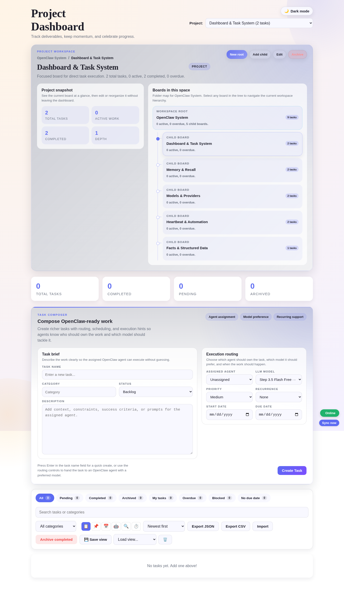
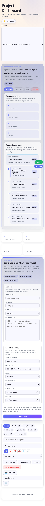

# OpenClaw Project Dashboard

`2.0.0-rc.2`

Operations-first dashboard for OpenClaw. It gives you hierarchical boards, OpenClaw-aware task composition, agent queue visibility, audit trails, and a thin bridge back into the OpenClaw runtime so the dashboard is not just a passive UI.

## Screenshots

<p align="center">
  
  
</p>

## What This RC Includes

- Folder-style project hierarchy with parent and child boards
- Project context manager with create, edit, archive, and child-board actions
- Rich task composer with agent assignment, preferred LLM model, priority, recurrence, start date, and due date
- Dedicated `/agents` workspace with live OpenClaw agent status, queue presence, and per-agent detail rail
- OpenClaw bridge endpoints so agents can watch for runnable work and write status back into the dashboard
- Improved list filtering, subtask expansion, and live stats consistency
- Release-ready packaging, install docs, and environment-driven runtime paths

## Install

Two install modes are documented:

- OpenClaw workspace install: [docs/install-openclaw.md](docs/install-openclaw.md)
- Standalone repo install: [docs/install-standalone.md](docs/install-standalone.md)

Quick OpenClaw workspace install:

```bash
git clone https://github.com/pgedeon/openclaw-project-dashboard.git ~/.openclaw/workspace/dashboard
cd ~/.openclaw/workspace/dashboard
npm install
cp .env.example .env
psql -U openclaw -d openclaw_dashboard -f schema/openclaw-dashboard.sql
npm start
```

When the repo is installed at `~/.openclaw/workspace/dashboard`, the server auto-detects the workspace path. If you install elsewhere, set `OPENCLAW_WORKSPACE` and `OPENCLAW_CONFIG_FILE`.

## Runtime Model

The dashboard is served by `task-server.js` and stores data in PostgreSQL by default.

- Agents page: `agents.html`
- UI entry: `dashboard.html`
- API server: `task-server.js`
- Storage layer: `storage/asana.js`
- Frontend integration: `src/dashboard-integration-optimized.mjs`

Important OpenClaw-aware endpoints:

- `GET /api/task-options`
- `GET /api/projects/default`
- `GET /api/views/agent`
- `GET /api/agents/status`
- `POST /api/agents/heartbeat`

## Repository Layout

```text
.
├── dashboard.html
├── task-server.js
├── storage/
│   └── asana.js
├── src/
│   ├── dashboard-integration-optimized.mjs
│   ├── board-view.mjs
│   ├── timeline-view.mjs
│   ├── agent-view.mjs
│   └── offline/
├── schema/
│   └── openclaw-dashboard.sql
├── scripts/
│   ├── dashboard-health.sh
│   ├── dashboard-validation.js
│   ├── migrate-dashboard-to-asana.js
│   └── sync-openclaw-projects.mjs
└── docs/
    ├── admin-guide.md
    ├── api.md
    ├── development.md
    ├── install-openclaw.md
    ├── install-standalone.md
    └── user-guide.md
```

## Configuration

See [.env.example](.env.example) for the supported environment variables.

The most important ones are:

- `PORT`
- `STORAGE_TYPE`
- `POSTGRES_HOST`
- `POSTGRES_PORT`
- `POSTGRES_DB`
- `POSTGRES_USER`
- `POSTGRES_PASSWORD`
- `OPENCLAW_WORKSPACE`
- `OPENCLAW_CONFIG_FILE`
- `OPENCLAW_BIN`

## Development

```bash
npm install
npm run validate
node tests/test-filter-behavior.js
```

If the dashboard server is already running on another port, point validation at it:

```bash
DASHBOARD_API_BASE=http://localhost:3887 node scripts/dashboard-validation.js
```

## Release Candidate Notes

This repository snapshot targets `github.com/pgedeon/openclaw-project-dashboard` and is tagged as `v2.0.0-rc.2`.

Release notes: [RELEASE.md](RELEASE.md)  
Change history: [CHANGELOG.md](CHANGELOG.md)

## License

MIT. See [LICENSE](LICENSE).
