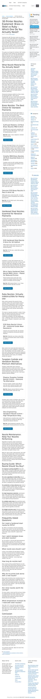

# OpenClaw Project Dashboard

`2.0.0-rc.2`

Operations-first project dashboard for OpenClaw. Hierarchical boards, agent-aware task composition, agent queue visibility, audit trails, and a thin bridge back into the OpenClaw runtime — not just a passive UI.

## Screenshots

### Dashboard

<p align="center">
  
</p>

### Agents

<p align="center">
  
</p>

### Operations

<p align="center">
  
</p>

### Workflows

<p align="center">
  
</p>

### Skills & Tools

<p align="center">
  
</p>

## Features

- **Project hierarchy** — Folder-style parent/child boards with project context manager
- **Kanban boards** — Drag-and-drop columns with configurable workflows
- **Rich task composer** — Agent assignment, preferred LLM model, priority, recurrence, start/due dates
- **Agent workspace** — Dedicated `/agents` page with live status, queue presence, and per-agent detail rail
- **Workflows engine** — Custom state machines per project (Kanban, content pipeline, bug triage)
- **Operations view** — Runbook templates, department metrics, and operational followup
- **Skills & tools** — Reference page for agent skills, tools, and capabilities
- **OpenClaw bridge** — Endpoints for agents to watch for runnable work and report status back
- **Audit trail** — Full change history with actor, action, and before/after diffs
- **Filtering & views** — List, board, timeline, and cron views with toolbar filters
- **Offline support** — Service worker + IndexedDB for offline task access

## Install

Two install modes:

- **OpenClaw workspace install**: [docs/install-openclaw.md](docs/install-openclaw.md)
- **Standalone repo install**: [docs/install-standalone.md](docs/install-standalone.md)

### Quick start (with demo data)

```bash
git clone https://github.com/pgedeon/openclaw-project-dashboard.git
cd openclaw-project-dashboard
npm install
cp .env.example .env

# Create database and load schema + demo data
createdb openclaw_dashboard
psql -d openclaw_dashboard -f schema/openclaw-dashboard.sql
psql -d openclaw_dashboard -f schema/demo-seed.sql

npm start
```

Open [http://localhost:3876](http://localhost:3876) in your browser.

### OpenClaw workspace install

When the repo is installed at `~/.openclaw/workspace/dashboard`, the server auto-detects the workspace path. If you install elsewhere, set `OPENCLAW_WORKSPACE` and `OPENCLAW_CONFIG_FILE` in `.env`.

```bash
git clone https://github.com/pgedeon/openclaw-project-dashboard.git ~/.openclaw/workspace/dashboard
cd ~/.openclaw/workspace/dashboard
npm install
cp .env.example .env
psql -U openclaw -d openclaw_dashboard -f schema/openclaw-dashboard.sql
npm start
```

## Architecture

The dashboard is a Node.js + PostgreSQL stack with a vanilla JS frontend (no framework, no build step).

- **API server**: `task-server.js`
- **Storage layer**: `storage/asana.js`
- **Frontend entry**: `dashboard.html`
- **Agents page**: `agents.html`
- **Operations page**: `operations.html`
- **Workflows page**: `workflows.html`
- **Skills & tools page**: `skills-tools.html`
- **Frontend modules**: `src/dashboard-integration-optimized.mjs` + lazy-loaded views
- **Service worker**: `sw.js`

### Key API endpoints

| Endpoint | Description |
|----------|-------------|
| `GET /api/task-options` | Task composition options (agents, models, priorities) |
| `GET /api/projects/default` | Default project info |
| `GET /api/views/agent` | Agent-queue filtered view |
| `GET /api/agents/status` | Live agent status |
| `POST /api/agents/heartbeat` | Agent heartbeat ping |
| See [docs/api.md](docs/api.md) | Full API reference |

## Repository Layout

```text
.
├── dashboard.html              # Main UI entry
├── agents.html                 # Agent workspace
├── operations.html             # Operations view
├── workflows.html              # Workflows management
├── skills-tools.html           # Skills & tools reference
├── task-server.js              # API server
├── storage/
│   └── asana.js                # PostgreSQL storage layer
├── src/                        # Frontend ES modules
│   ├── dashboard-integration-optimized.mjs
│   ├── agents-page.mjs
│   ├── workflows-page.mjs
│   ├── operations-page.mjs
│   ├── views/                  # Lazy-loaded view components
│   ├── offline/                # Offline/sync support
│   ├── styles/
│   └── locales/
├── schema/
│   ├── openclaw-dashboard.sql  # Base schema
│   ├── demo-seed.sql           # Demo data
│   └── migrations/             # Schema migrations
├── scripts/                    # Admin & validation scripts
├── tests/                      # Test suites
├── lib/                        # Shared utilities
├── runbooks/                   # Workflow runbook templates
└── docs/
    ├── admin-guide.md
    ├── api.md
    ├── development.md
    ├── install-openclaw.md
    ├── install-standalone.md
    └── user-guide.md
```

## Configuration

See [.env.example](.env.example) for all supported environment variables.

| Variable | Description | Default |
|----------|-------------|---------|
| `PORT` | Server listen port | `3876` |
| `STORAGE_TYPE` | Storage backend | `postgres` |
| `POSTGRES_HOST` | PostgreSQL host | `localhost` |
| `POSTGRES_PORT` | PostgreSQL port | `5432` |
| `POSTGRES_DB` | Database name | `openclaw_dashboard` |
| `POSTGRES_USER` | Database user | `openclaw` |
| `POSTGRES_PASSWORD` | Database password | — |
| `OPENCLAW_WORKSPACE` | Path to OpenClaw workspace | auto-detected |
| `OPENCLAW_CONFIG_FILE` | Path to openclaw.json | auto-detected |
| `OPENCLAW_BIN` | Path to openclaw binary | `openclaw` |

## Development

```bash
npm install
npm run validate          # Run dashboard validation
node tests/test-filter-behavior.js
npm test                  # Playwright E2E tests
```

Point validation at a running server:

```bash
DASHBOARD_API_BASE=http://localhost:3887 node scripts/dashboard-validation.js
```

## Release

This release candidate is tagged `v2.0.0-rc.2`.

- [Release notes](RELEASE.md)
- [Changelog](CHANGELOG.md)

## License

MIT. See [LICENSE](LICENSE).
